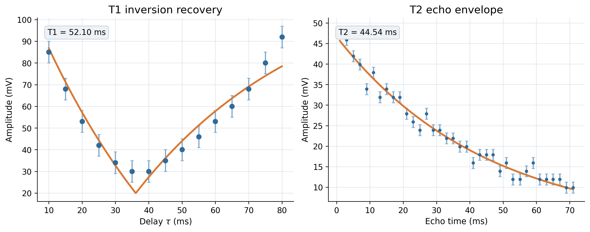
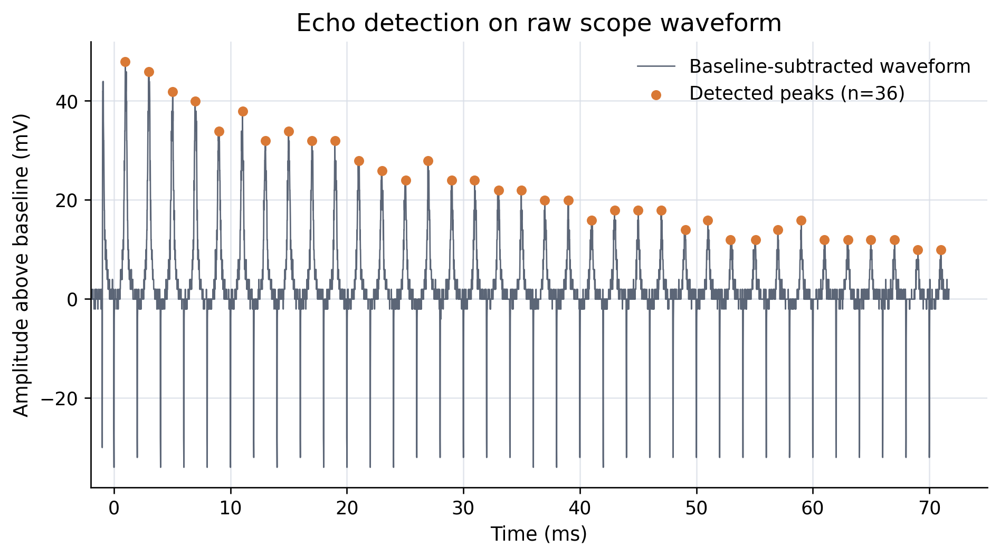

# Pulsed NMR relaxation analysis

This repository analyzes a pulsed nuclear magnetic resonance experiment from the UCSB upper-division physics lab. The focus is on a reproducible Python workflow for extracting resonance, `T1`, and `T2` from oscilloscope waveforms and manually recorded timing measurements.

## What This Demonstrates

This project shows a complete Python analysis loop: raw waveform parsing, noise
estimation, automated peak detection, weighted nonlinear fitting, uncertainty
reporting, generated figures, and regression tests. The same workflow habits transfer
directly to data pipelines where noisy inputs must become auditable, reproducible
measurements.

## At a Glance

- **Data workflow:** oscilloscope waveforms and manual timing records are parsed into
  processed tables, JSON summaries, and rendered figures.
- **Methods signal:** peak detection, weighted nonlinear fitting, baseline-noise
  estimation, and complementary checks for `T1` and `T2`.
- **Reproducibility signal:** package-style source code, CLI script, Makefile, and
  regression tests make the analysis rerunnable from raw inputs.
- **Transferable skill:** the project demonstrates how I turn noisy measurement data
  into documented quantities, the same discipline needed for empirical social-science
  and institutional-record pipelines.

## Key results

| Quantity | Result |
| --- | ---: |
| Zero-beat resonance `f0` | `15.146 MHz` |
| Static magnetic field `B0` | `0.3557 T` |
| `T1` from zero crossing | `51.22 +/- 3.61 ms` |
| `T1` from weighted nonlinear fit | `52.10 +/- 1.08 ms` |
| `T2` from Meiboom-Gill fit | `44.55 +/- 1.05 ms` |
| Baseline RMS noise | `0.891 mV` |
| Echo peaks detected | `36` |

## Figures

**Summary dashboard**



**Echo detection on the raw waveform**



## Analysis workflow

- Parse the oscilloscope waveform export `DS0001A.CSV`
- Estimate baseline mean and noise from pre-trigger samples
- Detect echo peaks with `scipy.signal.find_peaks`
- Fit `T1` and `T2` with weighted nonlinear least squares
- Propagate uncertainty from the zero-crossing measurement
- Export figures and machine-readable summaries

Two complementary `T1` estimates are included:

1. A primary estimate from the zero crossing of the inversion-recovery signal
2. A cross-check from a weighted nonlinear fit to the magnitude-detector model

The `T2` pipeline uses the raw Meiboom-Gill waveform directly, including noise estimation, peak detection, and exponential-envelope fitting.

## Reproduce the analysis

```bash
python -m venv .venv
pip install -e .[dev]
python scripts/run_full_analysis.py
pytest -q
```

Main outputs:

- `data/processed/summary_results.json`
- `data/processed/t2_echo_peaks.csv`
- `figures/results_dashboard.png`
- `figures/t1_fit.png`
- `figures/t2_fit.png`
- `figures/t2_waveform_with_peaks.png`

## Repository structure

```text
data/       Raw measurements and processed summaries
figures/    Analysis figures generated by the scripts
notebooks/  Executed notebook for interactive review
report/     Final PDF report and LaTeX source
scripts/    End-to-end analysis entry point
src/        Reusable analysis code
tests/      Regression tests for the analysis pipeline
```

## Related files

- Final report: `report/PNMR_report.pdf`
- Executed notebook: `notebooks/01_pnmr_relaxation_analysis.ipynb`
